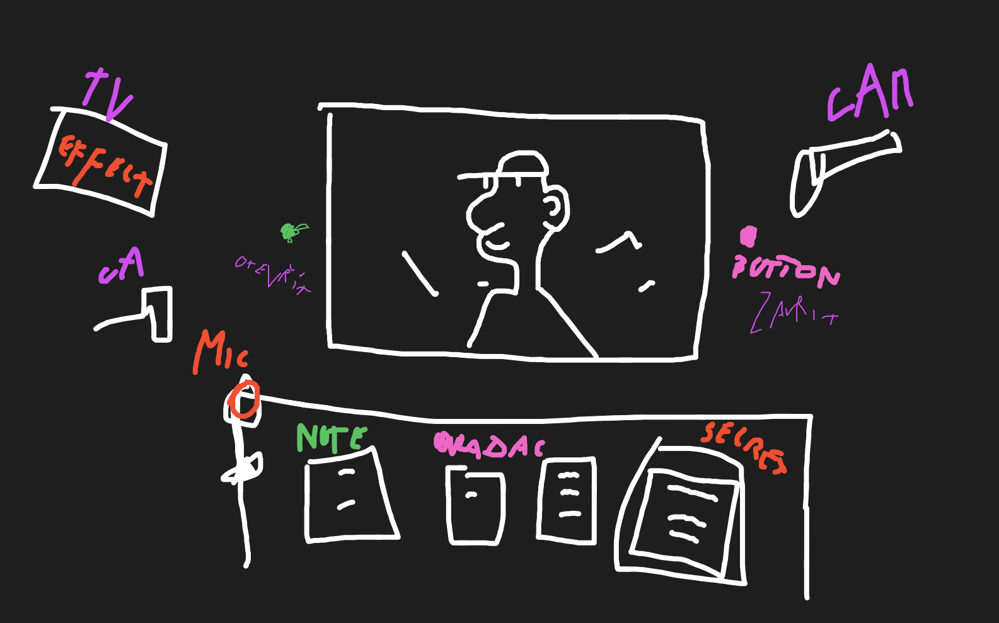
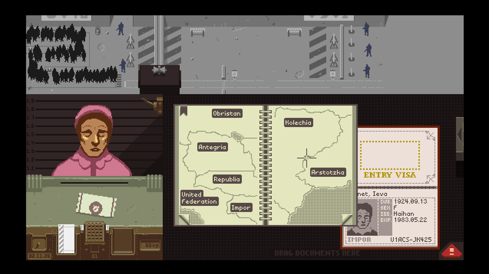

# Dreamland Gate

## Abstract

A multiplayer cooperative horror management game set at the fortified border wall of the world's only remaining nation—a horrific hybrid of a mega-capitalist dystopia and a totalitarian regime. Players assume the roles of Border Agents. Working from a static, high-stress perspective (FNAF-style), they must process incoming applicants, manage a desk full of tools, survive terrifying anomalies, and avoid execution by the regime's strict propaganda filters and the private sector's intrusive TV advertisements.

### Lore

Create a game about agents operating at the heavily fortified border wall of a totalitarian, hyper-capitalist regime. The outside world is ravaged by an analog horror apocalypse, but the regime's official stance is that everything is perfectly fine and utopian. The private sector is so dominant that corporations dictate border protocols alongside state security.

You are the gatekeeper. Your job is to process people trying to enter, interrogate them, and fabricate reasons to deny entry to the horrors outside without ever breaking the state's illusion.

A core secret of the state is that some of the "people" outside are actually terrifying anomalies or monsters (Alternates) attempting to blend in. However, it is strictly illegal to acknowledge this. If a player ever refers to a "person" as a "monster," or calls these creatures by their true classified names, they face immediate punishment. 

I take heavy inspiration from *Papers, Please* for game lore and style. I'd like to keep the entire lore and names fictional. Do not include any real names of parties, secret agencies or politicians.

### Gameplay

The core gameplay loop centers around interrogation, observation, extreme paranoia, and static desk management. You are stationed in a claustrophobic checkpoint filled with surveillance cameras and regime wiretaps.

* **FNAF-Style Perspective & Desk Management:** The player is seated in a static booth. Movement is limited to shifting the mouse to "look" at specific areas of the desk and the main window. Looking at your desk items means taking your eyes off the applicant.
* **The Interrogation Window:** Applicants approach the center window. They fall into three categories:
    * *Normal Humans:* Regular citizens to be processed.
    * *Social Wrecks:* Social undesirables; deny them entry using standard mundane reasons.
    * *Alternates/Monsters:* Poorly disguised anomalies. They might reveal physical glitches or say banned words.
* **The Bureaucratic Trap:** If you spot an anomaly, you cannot sound a "monster alarm." Instead, you must find a mundane bureaucratic excuse to deny them entry to keep the regime's illusion intact. You either hit the **Green Accept Button** to let them in, or **Close the Window** to deny them.
* **The Secret Book:** You have a highly classified, constantly updating rulebook on your desk. It contains subtle traits of the anomalies and **a strict list of banned words—which explicitly includes the actual names and types of the monsters**.
* **Surveillance, TTS Mic & Wiretapping:** Players communicate via a physical microphone on the desk. You must turn to the mic and type your message, which broadcasts as Text-to-Speech (TTS) to other players. The regime tracks every word. If you type a banned word (like a monster's name), it triggers an alert. Messages have strict length limits, forcing players to invent code words.
* **Death & TV Advertisements:** The regime forces you to watch TV in your booth. If a player dies (eaten by a monster or executed), it is not announced. Instead, an annoying, mandatory TV commercial for *graveyard services or burial insurance* pops up on all surviving players' screens. Survivors must actively look away from the window and use their physical **TV Remote** to turn it off. Dead players enter Spectator Mode.
* **Multiplayer Paranoia (The Tribunal):** At the end of a shift, a court session is held (similar to the Mafia/Městečko Palermo party game). If the team missed a banned action, let an anomaly through, or someone broke a rule, the state will execute a random player or punish the entire team.
* **Progression & Special Days:** The game gets harder over time. Allowed TTS message lengths get shorter, and monsters get better at hiding. There are weekly events, like "Black Friday," where the TV is aggressively bombarding players with ads, requiring constant use of the TV remote.
* **Custom Modes (Chaotic Fun):** Players can create custom regime rulesets (e.g., an "anti-brainrot" custom regime) where specific words or numbers (like typing "67") lead to an immediate, broadcasted execution.

### Visuals

Must be 2D, because of our skills.

I'd take heavy inspiration from *Papers, Please*, so that it matches the pixelated style. Don't rip it off though one2one.

For character design, it would be incredibly fun to create **pixel art people with exaggerated, quirky features** (like huge noses and bizarre proportions). This slightly comical look would create a great, unsettling contrast with the dark **analog horror** atmosphere, the claustrophobic checkpoint full of red camera lenses, and the brutal 1984 aesthetic of the game UI.

#### Booth Wireframe / Layout (not the one in the upper image - just a sketch)
* **Top Screen:** The TV displaying capitalist ads / Death Ads.
* **Center Screen:** The main window viewing the applicant.
* **Left Desk:** The physical Notes Book for checking off applicant information.
* **Center Desk:** The TV Remote (to skip ads) and the Accept/Deny (Close Window) buttons.
* **Right Desk:** The Secret Notebook (regime rules) and the Text-To-Speech Microphone. (Looking here means you cannot see the window).

-FK

