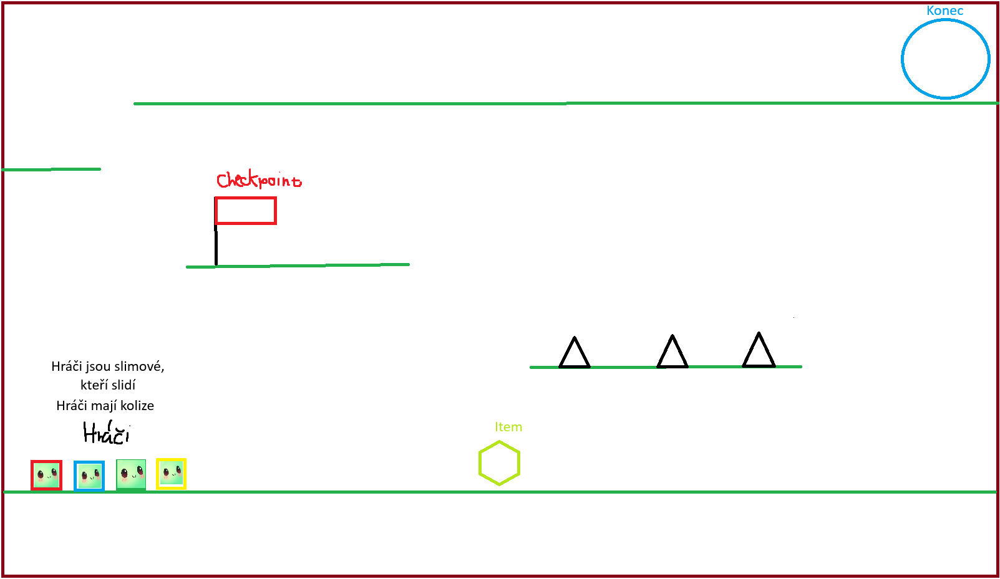

- expanding: [on idea](./FK_slime_jump.md)

# Battle Jumper

### Lore

- There is no lore

### Gameplay

- This game can be played in multiplayer (unknown max players but more than 1)
- Main goal of this game is to be the first to reach (konec) circle.
  - If everybody dies, the game is a tie.
- Around the map you can spot traps (spikes) that can kill you and you won't respawn (that means you cannot win this round)
- Players also can pick items around the map to gain additional advantages to win that game
  - Those items will be randomized and their spawn locations are random.
- Players will have collision so they can bump into other players
- Map may be randomized or pre-made. For now, the exact type of map is not yet decided.

-MA
