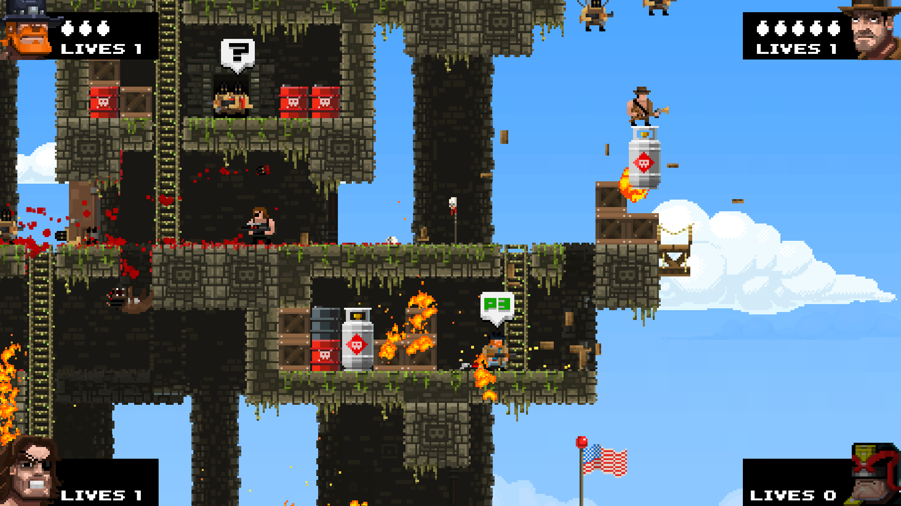
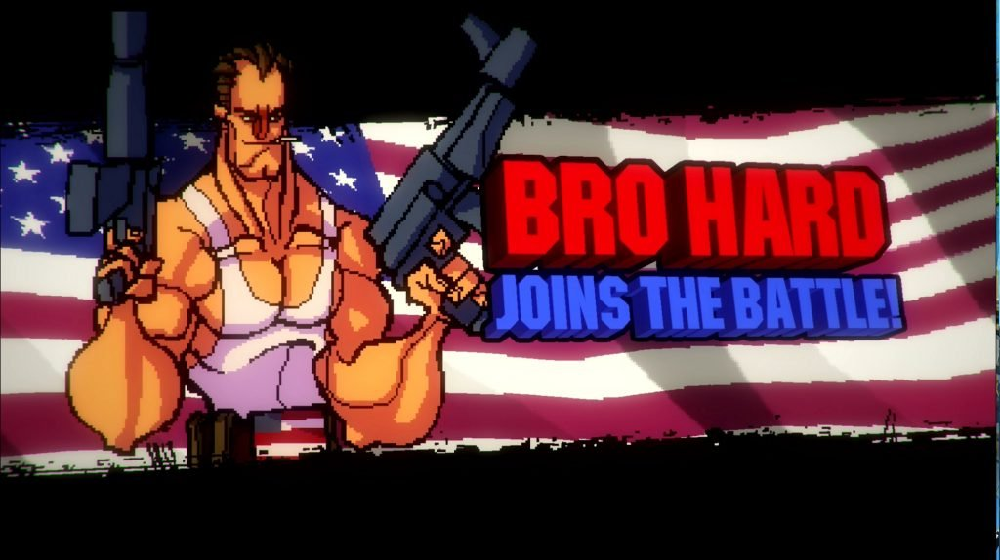

### Lore

I was thinking about American soldier Travis Mills. Which had a severe injury of losing parts of all the limbs. I'd like to portrait this idea into a game. It doesn't have to mean to recreate his story, but build on it and create something similar. 

[See this video for context](https://www.youtube.com/watch?v=A2yk_GmoNn4)

### Gameplay

I could not think of it any other way than it being a little of an idle game. I don't like it to be solely focused on being a clone of cookie clicker and just upgrading the stats. It needs more, but it'd need to be some kind of RPG, so that you level yourself, go through traings, have a lot of minigames, which would be fun.

### Visuals

2D pixelated funky style like broforce, but I'd make it top down, maybe **2.5D**, so that it's in rooms.

